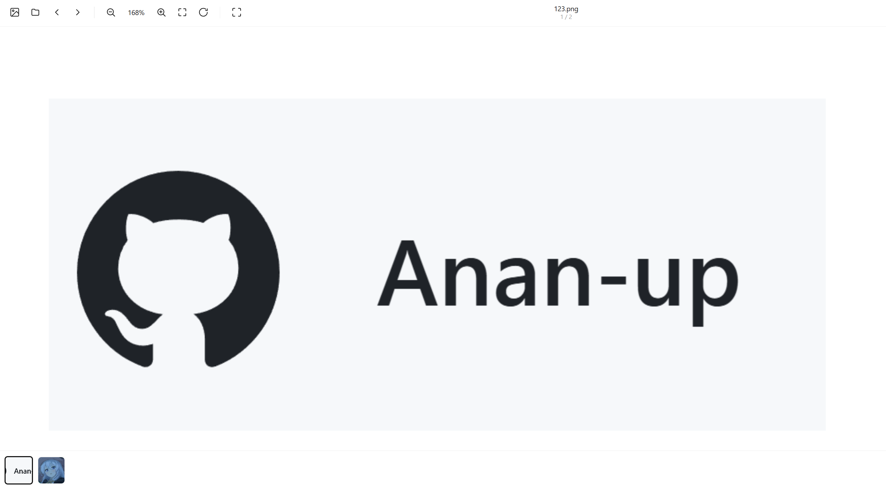

[English](README.md) | [简体中文](README_Simplified_Chinese.md) | [繁體中文](README_Classical_Chinese.md)

## 一、整体定位

一个**零依赖、纯原生 JS、单文件**的本地图片查看器。所有处理在浏览器本地完成，不上传任何文件。UI 为简体中文，走极简白底风格（类似 macOS 预览/Google Photos 的轻量版）。

---

## 二、功能清单

| 分类 | 能力 |
|---|---|
| 打开 | 拖拽到窗口/文件夹（递归展开）、文件选择、文件夹选择（`webkitdirectory`） |
| 浏览 | 上一张/下一张、缩略图条（>1 张才显示）、循环切换 |
| 缩放 | 滚轮（指针为锚点）、双指 pinch、双击切换 fit/1:1、按钮/快捷键 |
| 视图 | 适应窗口(fit)、实际大小(100%)、旋转 90°、全屏 |
| 管理 | 删除当前项、Esc 清空、去重（路径+size+lastModified） |
| 沉浸 | 放大超出 fit 时自动隐藏上下工具栏，鼠标移到上下边缘 44px 内临时唤出 |
| 格式 | JPG/PNG/GIF/WebP/SVG/BMP/ICO/AVIF/TIF 等 |

---

## 三、架构与数据流

```
状态 state {scale, tx, ty, rot, index}   数据 items[{file,url,name,path,key}]
        ↓                                        ↓
    apply() 写 stage.transform            渲染 img / thumbs / 工具栏文本
```

- **单一 `` 复用**：切图只换 `src`，不重建 DOM。
- **stage 包裹层**：`transform-origin:0 0`，图片用 `translate(-50%,-50%)` 把自己的中心对齐到 stage 原点。于是 `(tx,ty)` 的语义非常干净——**图片中心在视口中的坐标**。

---

## 四、核心实现要点

### 1. 变换模型（数学很干净）
```js
stage.transform = `translate(tx,ty) scale(s) rotate(rot)`
```
所有缩放/平移都只改 `tx/ty/scale`，图像本身不重排。

### 2. 以指针为锚点缩放
```js
T' = m - k·(m - T)   // k = newScale/oldScale
```
`zoomAt` 和 `updatePinch` 用的是同一套公式，pinch 额外叠加双指整体位移。这样缩放时"手指下的像素"不动，体验自然。

### 3. ⭐ P0 关键设计：fitScale 与 immersive 解耦
这是全文件最值得称道的一处修正。问题是：

- 沉浸模式下视口从 `h-54` 变成 `h`；
- 如果 fitScale 用**实际视口高度**算，放大触发沉浸 → 视口变高 → fitScale 变大 → scale 相对变小 → 退出沉浸 → 视口变矮 → ……**死循环抖动**。

解法是让 `computeFitScale()` 恒定使用 `win.h - BAR`，与实际视口高度无关；`fit()` 的居中仍用真实 `vp.h/2`（视觉即时正确）。判据统一，杜绝抖动。

```js
// 基准高度固定为 win.h - BAR，与 immersive 解耦
return Math.min(win.w / w, Math.max(0, win.h - BAR) / h);
```

### 4. 几何缓存，避免强制同步布局
```js
let vp  = {left,top,w,h}   // ResizeObserver 刷新
let win = {w,h}            // resize 刷新
let imgDim = {w,h}         // onload 刷新一次
```
`pointermove`、pinch、`checkEdgeReveal` 全程读缓存，不读 `getBoundingClientRect()`/`innerHeight`。这是拖拽跟手流畅的关键。

### 5. 多点触控状态机
用 `Map<pointerId, {x,y}>` 管理：

| 事件 | 处理 |
|---|---|
| 按下第 1 指 | 进入拖拽 |
| 按下第 2 指 | 结束拖拽，建立 pinch 基线 |
| 按下第 3+ 指 | 忽略，`pinch = null` 防抖 |
| 从 2 指松到 1 指 | 以剩余指为新起点继续拖拽 |
| 从 3 指松回 2 指 | **无条件重建 pinch 基线**（P0，否则"既不拖也不缩"冻结） |

配合 `setPointerCapture`，指针移出视口也不会丢事件。

### 6. 过渡控制
拖拽/pinch/切图定位时 `stage.style.transition='none'`，松手或用 `requestAnimationFrame` 恢复，避免"橡皮筋延迟感"和"图片飞入"。

---

## 五、文件处理

- **去重键**：`(webkitRelativePath||name) + size + lastModified`——避免不同目录同名文件被误判。
- **排序**：只对**本批次**按路径 `localeCompare('zh')` 排序（多次拖入时全局顺序可能不理想）。
- **拖拽目录**：`webkitGetAsEntry()` → 递归 `createReader().readEntries()`，用 `do...while` 循环是因为 `readEntries` **每次最多返回 100 条**，必须反复读到空数组。

---

## 六、无障碍（A11y）做得比一般 Demo 细致

- 缩略图 `role="button"` + `tabIndex=0` + `aria-label` + `:focus-visible` 外框。
- 缩略图内部 `` 标装饰，避免读屏重复播报。
- 删除按钮 `aria-hidden="true"`（删除统一走 Delete 键，避免 a11y 树里出现语义歧义）。
- `pct` 只在百分比**实际变化**时才写 DOM，并附带 `aria-label`——防止屏幕阅读器在拖拽时逐帧播报。
- 删除/清空后主动把焦点转移到合理的元素（新当前缩略图 / "选择图片"按钮），不让焦点掉到 `body`。
- 空格键在焦点位于 `button/[role=button]/a/textarea/select` 时**不劫持**，交还原生激活行为。
- 图标按钮自动从 `title` 补 `aria-label`。

---

## 七、内存与生命周期

- `URL.createObjectURL` + 删除/清空时 `revokeObjectURL`。
- **`pagehide` 替代 `beforeunload`**，并检查 `e.persisted`：若页面进入 bfcache 则不回收，否则前进/后退恢复后图片会全挂。这是很典型的正确姿势。

---

## 八、代码注释里的 P0–P3 标记

这套标记说明代码经过了一轮**系统性的 review/迭代**，注释写的是"为什么"而不是"做了什么"，可读性远高于普通 Demo：

- **P0**：会导致功能性 bug 的（fit/immersive 死循环、pinch 基线冻结）
- **P1**：影响可用性（空格劫持按钮、bfcache 回收）
- **P2**：体验/性能细节（DOM 写入守卫、缓存读几何、沉浸态残留）
- **P3**：打磨项（焦点管理、尺寸复位）

---
## 项目截图

---
## 许可证

[MIT](LICENSE)
